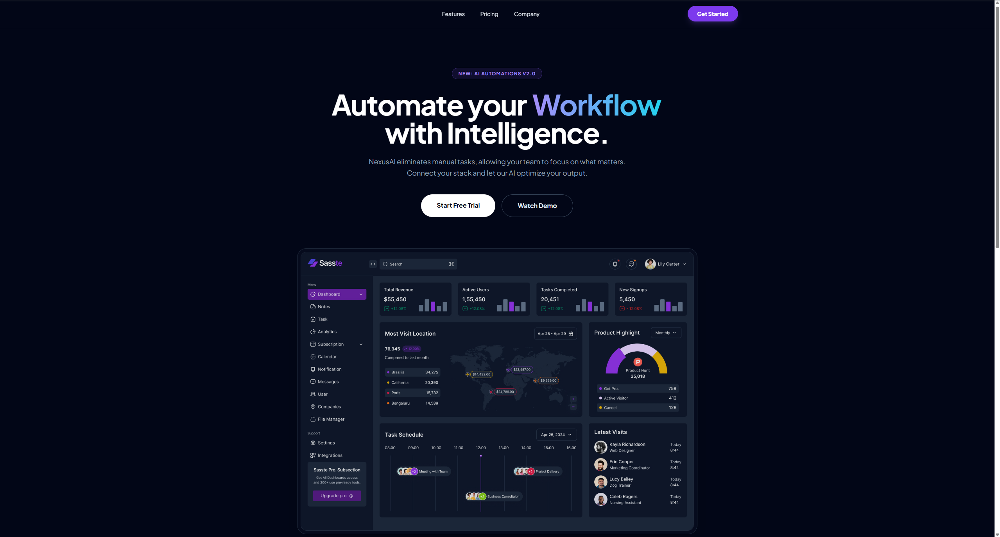

# 🚀 NexusAI - Next-Gen SaaS Landing Page

[]([\[LINK_DA_VERCEL_AQUI\]](https://saas-landing-page-three-puce.vercel.app/))
[](https://tailwindcss.com)

A high-performance, dark-themed landing page designed for SaaS (Software as a Service) products. This project showcases modern UI/UX trends like **Glassmorphism**, **Gradient Typography**, and **Smooth Interaction**.

**🌎 [Live Demo](https://saas-landing-page-three-puce.vercel.app/)**

---

## 💎 Design Strategy
- **Modern Tech Aesthetic:** Dark mode interface using a deep slate palette (`#020617`) and violet/cyan accents.
- **Conversion Focused:** High-visibility CTAs and a strategic pricing table to drive user acquisition.
- **Micro-interactions:** Smooth scroll navigation and hover "glow" effects for enhanced engagement.

## 🛠️ Technical Implementation
- **Architecture:** Semantic HTML5 for better SEO and accessibility.
- **Styling:** Utility-first CSS using **Tailwind CSS** (v3).
- **Optimization:** Lazy-loading images and system-font stacks for near-instant load times.
- **Responsive:** Mobile-first approach, ensuring a perfect experience from mobile to ultra-wide monitors.

## 📸 Preview
<div align="center">
  
</div>

---

## 🛠️ Local Development

1. Clone the repository:
   ```bash
   git clone [https://github.com/](https://github.com/carolsalome/saas-landing-page)

